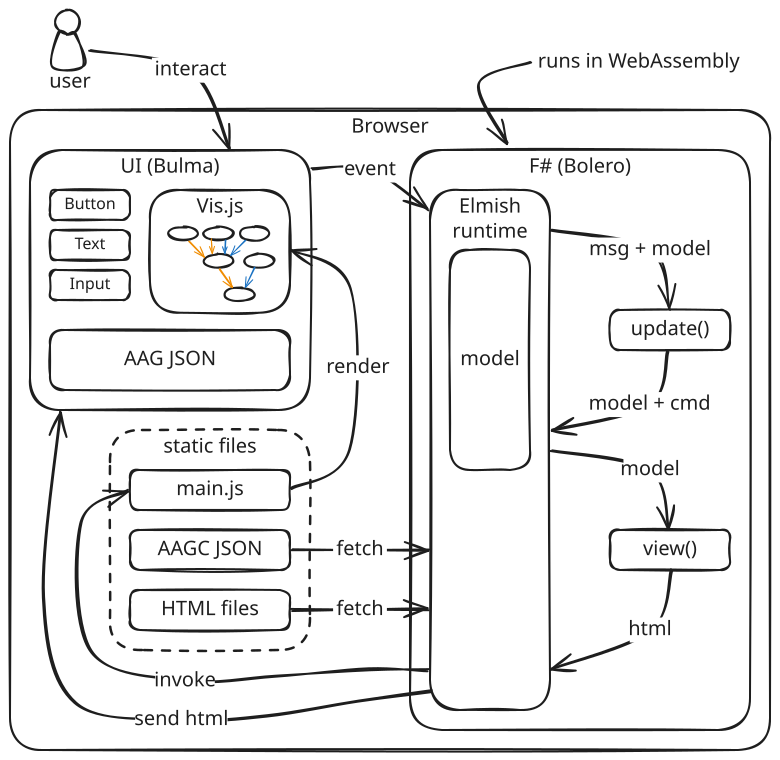

# account-access-graphs
A tool for modeling and analyzing account access graphs (see the paper [User Account Access Graph](https://doi.org/10.1145/3319535.3354193) for more info).

This tool was developed as a part of my master thesis _Modeling and Analyzing Account Access Graphs_ at _Berliner Hochschule für Technik (BHT)_.

## Deployment & Live Demo

Live Demo at: https://lnschroeder.github.io/account-access-graphs/.

This is automatically deployed via the [pipeline.yml](.github/workflows/pipeline.yml).

## Build application for development
```sh
dotnet watch
# or
dotnet build
```

The .NET SDK version is specified inside [global.json](global.json) and will be used automatically.

## Build application for deployment
This will create a production ready deployment of the application. It compiles and bundles all files, which then can be served as a static webserver.
```sh
# generate static content
dotnet publish -c Release -o release src/client/AAG.Client.fsproj

cd release/wwwroot/

# serve it as a webserver
dotnet serve --port 8080 # requires https://github.com/natemcmaster/dotnet-serve
# or
python3 -m http.server 8080
```

## Project structure
This is a [WebAssembly](https://webassembly.org/) project written in F# using [Bolero](https://fsbolero.io/). The Bolero framework uses [Elmish](https://elmish.github.io/elmish/) as its core architecture.



The [Startup.fs](src/client/fsharp/Startup.fs) is the entry point to the code, which initializes the Elmish program, whose `update()` and `view()` functions are defined in [Main.fs](src/client/fsharp/Main.fs). 
The `view()` function populates the [index.html](src/client/wwwroot/index.html) using the 
[templates HTMLs](src/client/wwwroot/templates).

The _Account Access Graph Components (AAGCs)_ can be found in [src/client/wwwroot/resources/aagc](src/client/wwwroot/resources/aagc). 
